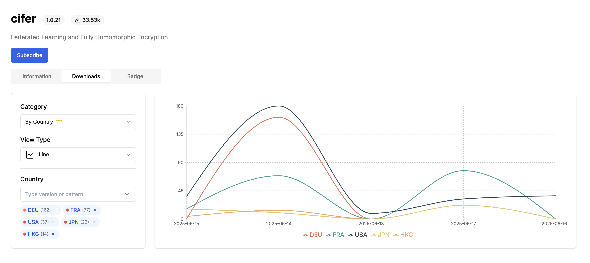

# Cifer Installer Traction

This repository tracks the installation traction of the `cifer` Python package across different countries using publicly available statistics from [PyPI](https://pypi.org/project/cifer/) and [Pepy.tech](https://pepy.tech/projects/cifer)

## Purpose

To keep a record of global adoption trends of the Cifer installer by archiving download statistics by country. This helps us:

- **Maintain historical records** of Cifer's global installation activity
- **Track geographic growth** to support localization and outreach efforts
- **Provide reference data** for internal reports and stakeholder updates

## Screenshot Examples

These screenshots are generated from country distributions shown on [Pepy.tech – cifer](https://pepy.tech/projects/cifer).  

## Related Links

- Website: [https://cifer.ai](https://cifer.ai)
- PyPI: [https://pypi.org/project/cifer](https://pypi.org/project/cifer)
- Docs: [https://ciferai.gitbook.io/fl](https://ciferai.gitbook.io/fl)
- Cifer FedLearn Framework GitHub Repo: [https://github.com/CiferAI/ciferai](https://github.com/CiferAI/ciferai)
